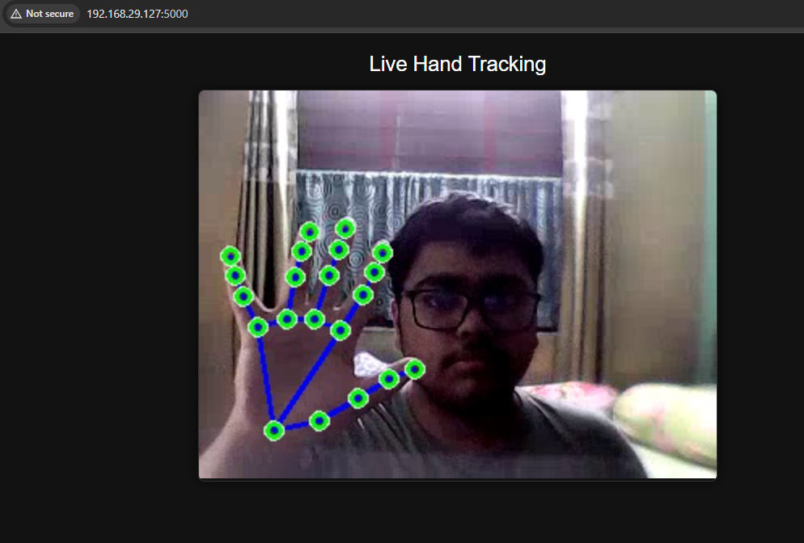
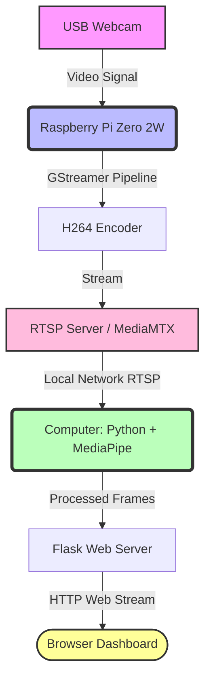

# ✋ Real-Time Hand Tracking using Raspberry Pi RTSP & MediaPipe

[](https://opensource.org/licenses/MIT)
[](https://www.python.org/downloads/)

<p align="center">
  
  
</p>


A **low-latency hand tracking system** built using a Raspberry Pi Zero 2W, USB Webcam, RTSP streaming (H264), Google's MediaPipe Hand Tracking, and a Flask Web Streaming dashboard. 

The Raspberry Pi streams camera footage via **RTSP**, a more powerful computer processes the stream using **MediaPipe**, and the result is displayed on a responsive **Flask web dashboard** accessible on any local device. This architecture significantly reduces latency compared to traditional MJPEG streaming.

---

## 📸 Demo & Screenshots

> **Note:** Add your project demo GIF here!  
> ``

| Web Dashboard | Hardware Setup |
| :---: | :---: |
| `` <br> *Live Flask Tracking Dashboard* | `` <br> *Raspberry Pi Zero 2W Setup* |

---

## 🏗️ System Architecture

The architecture relies on a lightweight RTSP server on the Pi and offloads the heavy AI processing to a computer.



---

## ✨ Features

- **⚡ Low Latency Streaming**: Utilizing H.264 over RTSP instead of sluggish MJPEG.
- **🦾 Real-Time Hand Tracking**: Powered by Google MediaPipe for blazing fast 21-point 3D hand landmarks.
- **🌐 Universal Access**: Accessible on any device (phone, tablet, PC) within the same WiFi network.
- **🔄 Auto-Reconnect**: Robust script that automatically reconnects if the camera stream drops.
- **🎨 Clean Dashboard**: A modern, responsive Flask UI to view the feed.
- **🧱 Scalable Architecture**: Easy to upgrade to multiple cameras or different AI models.

---

## 🛠️ Hardware Requirements

- **Raspberry Pi Zero 2W** (or Pi 3/4)
- **USB Webcam** (or CSI Pi Camera with adapted GStreamer pipeline)
- **MicroSD Card** (16GB+ recommended)
- **Power Supply** for the Pi
- **WiFi Network**
- **Computer** (Windows/Mac/Linux) for MediaPipe processing

### 🔌 Hardware Wiring Guide

Setting up the hardware is straightforward:
1. Connect the **USB Webcam** to the Raspberry Pi's USB port (using a micro-USB OTG adapter if using a Pi Zero).
2. Insert a flashed **MicroSD Card** with Bookworm OS.
3. Power the Raspberry Pi via its PWR terminal.

---

## 📦 Software Requirements

### Raspberry Pi
- Raspberry Pi OS (Bookworm recommended, 32-bit or 64-bit)
- GStreamer (`gstreamer1.0`)
- MediaMTX (RTSP server)

### Computer
- Python 3.8+
- OpenCV (`opencv-python`)
- MediaPipe (`mediapipe`)
- Flask (`flask`)

---

## 🚀 Setup Instructions

### Part 1: Raspberry Pi Setup (RTSP Server)

#### Step 1: Update Raspberry Pi
```bash
sudo apt update
sudo apt upgrade -y
```

#### Step 2: Install Required Packages
```bash
sudo apt install -y \
    gstreamer1.0-tools \
    gstreamer1.0-plugins-base \
    gstreamer1.0-plugins-good \
    gstreamer1.0-plugins-bad \
    gstreamer1.0-plugins-ugly \
    gstreamer1.0-libav \
    gstreamer1.0-rtsp \
    v4l-utils
```

#### Step 3: Check Webcam Detection
Connect the USB webcam and verify it is detected:
```bash
ls /dev/video*
```
*Expected output: `/dev/video0`*

Check supported formats (optional):
```bash
v4l2-ctl --list-formats-ext -d /dev/video0
```

#### Step 4: Install MediaMTX (RTSP Server)
Download and extract MediaMTX for ARM:
```bash
wget https://github.com/bluenviron/mediamtx/releases/download/v1.15.2/mediamtx_v1.15.2_linux_armv7.tar.gz
tar -xvzf mediamtx_v1.15.2_linux_armv7.tar.gz
cd mediamtx
```

Start the RTSP server (leave this terminal running):
```bash
./mediamtx
```
*You should see: `RTSP server listening on :8554`*

#### Step 5: Start Camera Stream
Open another terminal on the Pi and run the GStreamer pipeline:
```bash
gst-launch-1.0 v4l2src device=/dev/video0 ! \
    video/x-raw,format=YUY2,width=320,height=240,framerate=20/1 ! \
    videoconvert ! \
    x264enc tune=zerolatency bitrate=300 speed-preset=ultrafast key-int-max=15 ! \
    rtspclientsink location=rtsp://127.0.0.1:8554/webcam
```

#### Step 6: Test the RTSP Stream (Optional but recommended)
1. Open **VLC Media Player** on your computer.
2. Go to **Media** → **Open Network Stream**.
3. Enter: `rtsp://<RASPBERRY_PI_IP>:8554/webcam` (e.g., `rtsp://192.168.29.19:8554/webcam`)
4. If working correctly, you will see the live video.

---

### Part 2: Computer Setup (AI Processing & Web Server)

#### Step 7: Setup Python Environment
Create a virtual environment:
```bash
python -m venv env
```

Activate it:
* **Windows:** `env\Scripts\activate`
* **Linux / Mac:** `source env/bin/activate`

Install dependencies:
```bash
pip install flask opencv-python mediapipe
```

#### Step 8: Update Script IP Address
Ensure the `rpi-cam.py` (or `hand_tracking_stream.py`) file has the correct Raspberry Pi IP address:
```python
STREAM_URL = "rtsp://192.168.29.19:8554/webcam" # <--- UPDATE THIS IP
```

---

## 🎮 Usage

#### Step 9: Run the Server
On your computer, run the processing server:
```bash
python rpi-cam.py
```

#### Step 10: Open Dashboard
Open a browser on any device connected to the same WiFi network and navigate to your computer's IP address:
```
http://<YOUR_COMPUTER_IP>:5000
```
*(Example: `http://192.168.29.50:5000`)*

The live hand tracking stream will appear!

---

## ⏱️ Performance Metrics

Typical latency breakdown:

| Stage | Estimated Delay |
| :--- | :--- |
| **RTSP Streaming** (Pi to PC) | ~150 ms |
| **MediaPipe Processing** (PC) | ~100 ms |
| **Flask HTTP Stream** (PC to Browser)| ~150 ms |
| **Total End-to-End Latency** | **~350–450 ms** |

---

## 🔧 Troubleshooting

- **No video in Flask Dashboard:** Test the RTSP stream first in VLC using `rtsp://<PI_IP>:8554/webcam`. Ensure the Pi is actively streaming.
- **Webcam not detected on Pi:** Run `ls /dev/video*`. If missing, check USB connections, cables, and power delivery.
- **High latency / lag:** Reduce the camera resolution in the GStreamer command (e.g., to `320x240`) or ensure your WiFi signal is strong between the Pi and the computer. You can also try lowering the `bitrate` in the `x264enc` command.
- **Error: Could not open RTSP stream:** Ensure the IP address in your Python code matches the Raspberry Pi's current local IP.

---

## 🚀 Future Improvements

- [ ] **Gesture-based robot control**: Translate hand landmarks into commands (Stop, Forward, Left, Right).
- [ ] **WebRTC streaming**: Migrate from Flask Multipart HTTP streaming to WebRTC for sub-100ms browser latency.
- [ ] **Multi-camera support**: Run multiple MediaMTX paths for multiple angles.
- [ ] **Object detection**: Add YOLOv8 alongside MediaPipe for general object awareness.
- [ ] **AI gesture commands**: Trigger computer macros (like volume control or slide presentations) based on specific pinches.

---

## 🤝 Contributing

Contributions are welcome! If you have ideas for improving latency, adding features, or refining the dashboard:

1. Fork the Project
2. Create your Feature Branch (`git checkout -b feature/AmazingFeature`)
3. Commit your Changes (`git commit -m 'Add some AmazingFeature'`)
4. Push to the Branch (`git push origin feature/AmazingFeature`)
5. Open a Pull Request

---

## 📜 License

Distributed under the **MIT License**. See `LICENSE` for more information.
